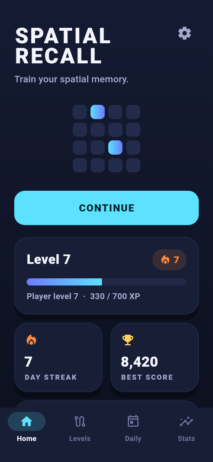
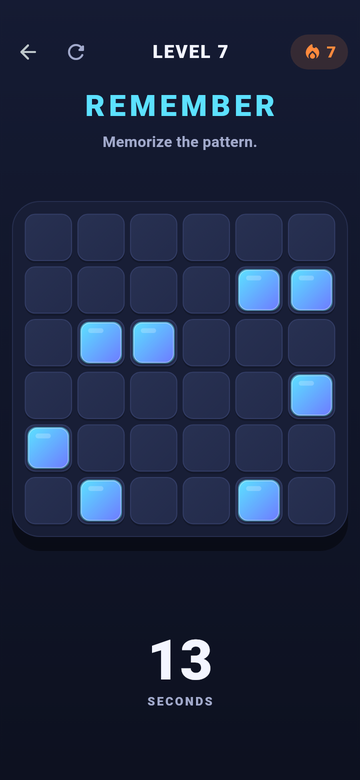
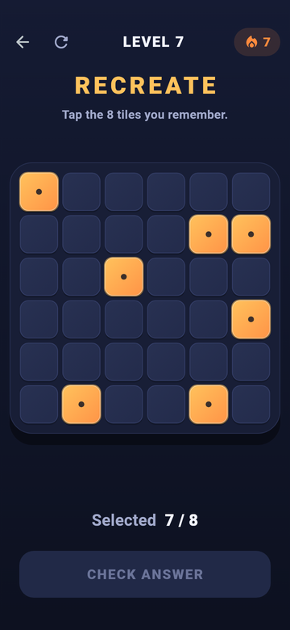
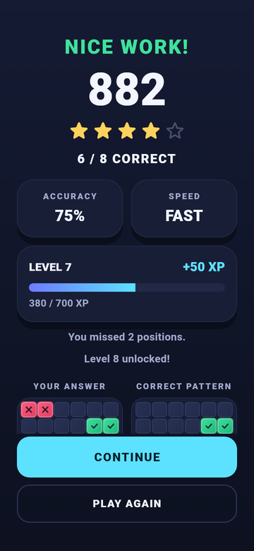

# Spatial Recall

A touch-first spatial memory game for Android, built with Flutter (plus Flame
for effects). Highlighted tiles flash on a grid, the board clears, and you tap
where they were.

<p>




</p>

The whole game runs offline. It has no backend, no login and no network calls,
and the release manifest doesn't request the `INTERNET` permission.

## Features

- 30 data-driven levels (`lib/game/logic/level_manager.dart`), from 5×5 with 3 tiles up to 8×8 with 24.
- **Daily Challenge** seeded by the date, so everyone gets the same board each day. Your first attempt is the official score; replays are practice.
- Scoring: +100 per tile, plus speed, perfect and streak bonuses (the streak multiplier is capped at ×1.5). Stars, XP and player levels on top.
- Daily play streak based on calendar dates, so DST changes and clock changes are handled.
- Results show "Your answer" next to "Correct pattern" (correct, wrong and missed tiles are marked with both colour and shape).
- Haptics and sound, each with an on/off switch. Reduced motion follows the in-app setting or the OS setting.
- Lifecycle-safe: going to the background pauses the round (the timer freezes and the board hides) until you tap Resume. The screen stays awake only during play.
- The Android back button asks before quitting a round. On other tabs it returns to Home.
- Portrait only. The board scales from 320dp phones up to tablets.

## Project layout

```
lib/
  main.dart                 portrait lock, edge-to-edge, storage bootstrap
  app/                      app widget, theme, routes/navigation helpers
  game/
    game_controller.dart    explicit GamePhase state machine + timestamp timer
    spatial_game.dart       Flame particle celebration
    models/                 TilePosition, Pattern, LevelConfig, PlayerData, …
    logic/                  pattern generator, scoring, levels, streak, daily, progression
    widgets/                SpatialBoard, tiles, timer, score widgets
  screens/                  splash, tutorial, home shell + tabs, intro, game, results, settings
  services/                 storage (SharedPreferences), audio, haptics
  state/app_state.dart      app-wide state + persistence
test/                       unit, widget (full flows) and screenshot tests
```

The board is plain Flutter widgets so it gets screen-reader semantics
("Row 3, Column 4, Selected") and reliable touch targets. Flame is used only for
the results celebration.

## Develop

```bash
flutter pub get
flutter analyze
flutter test                      # 50 tests, including full gameplay flows
flutter run                       # on an emulator or device
```

`test/screenshots_test.dart` renders every screen on a phone, a small phone
and a tablet into `build/screenshots/`.

## Release build

```bash
flutter build appbundle --release   # build/app/outputs/bundle/release/app-release.aab
flutter build apk --release         # build/app/outputs/flutter-apk/app-release.apk
```

CI (`.github/workflows/spatial-recall-android.yml`) runs analyze and tests, then
builds both files and uploads them as workflow artifacts.

### Release signing

Signing credentials are **never** committed.

1. Create an upload keystore:
   `keytool -genkey -v -keystore ~/spatial-recall-upload.jks -keyalg RSA -keysize 2048 -validity 10000 -alias upload`
2. Copy `android/key.properties.example` to `android/key.properties` (it is git-ignored) and fill in the values.
3. Run `flutter build appbundle --release`.

Without `key.properties`, release builds are signed with the debug key so they
still build, but Google Play rejects those uploads. In CI, set the
`ANDROID_KEYSTORE_BASE64`, `ANDROID_KEYSTORE_PASSWORD`, `ANDROID_KEY_ALIAS`
and `ANDROID_KEY_PASSWORD` secrets. Enable Play App Signing in the Play
Console.

### Before publishing

- **Package name:** change `com.example.spatialrecall` in `android/app/build.gradle.kts` (`namespace` and `applicationId`) and move `MainActivity.kt` to the matching folder. Google Play doesn't accept `com.example.*`.
- **Version:** `version: 1.0.0+1` in `pubspec.yaml`. Bump the build number (`+2`, `+3`, …) for every upload, and keep `appVersion` in `lib/screens/settings_screen.dart` in sync.
- **Store icon:** `store/play-icon-512.png`. The launcher icon is an adaptive vector (`android/app/src/main/res/drawable/ic_launcher_foreground.xml`) with a themed monochrome layer and PNG fallbacks.
- **Sounds:** the game uses the system click sound for now. To add real effects, implement `SoundPlayer` in `lib/services/audio_service.dart` (the steps are in its doc comment).
- **Privacy policy:** the in-app text says no data is collected. Host the same text at a URL for the Play listing.
